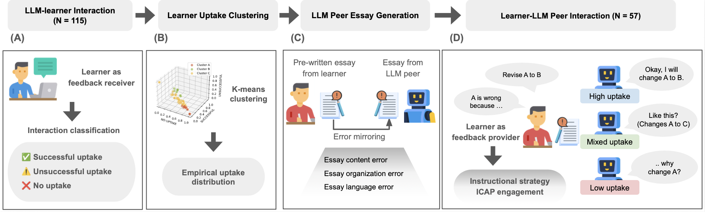

# Human Explanatory Behaviour with  an Imperfect LLM Partner

This repository provides the dataset and accompanying resources for studying learner-like feedback behaviours in learning-by-teaching interactions with imperfect LLM peers.

---

## Paper

**Human Explanatory Behaviour with  an Imperfect LLM Partner**  
Jieun Han, Junyeong Park, Seohyun Park, Haneul Yoo, Hyungwook Jin, Xing Xie, Evelyne Viegas, Sean Rintel, Miran Lee, Alice Oh, So-Yeon Ahn, Fangzhao Wu  

---

## Ethical Consideration

We do not condone any malicious use of this dataset. The data is available for research purposes only.
